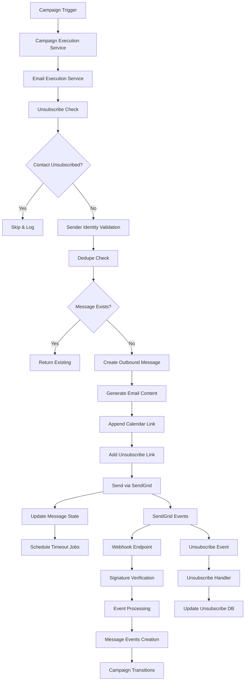

# Email Flow Audit Report

**Date:** 2025-01-25  
**Project:** DripIQ Email Campaign System  
**Auditor:** AI Assistant  

## Executive Summary

This comprehensive audit examined the email flow system built around SendGrid with campaign management, webhook processing, and unsubscribe handling. The system demonstrates robust architecture with comprehensive event tracking, but several critical production issues require immediate attention.

**Overall Assessment:** 🟡 **NEEDS ATTENTION** - System is functionally complete but has critical configuration and implementation gaps that must be addressed before production deployment.

---

## Email Flow Architecture

### Complete Email Journey



### Database Architecture

**Core Tables:**
- `outbound_messages` - Email sending records with deduplication
- `message_events` - Normalized engagement events (opens, clicks, bounces)
- `webhook_deliveries` - Raw webhook archive for audit trails
- `contact_unsubscribes` - Unsubscribe tracking by channel
- `email_sender_identities` - Verified sender configurations

---

## Component Analysis

### ✅ **Strengths**

1. **Comprehensive Event Tracking**
   - All SendGrid events captured and normalized
   - Duplicate detection prevents event reprocessing
   - Complete audit trail with webhook delivery storage

2. **Robust Security**
   - ECDSA signature verification for webhooks
   - Timestamp validation prevents replay attacks
   - Rate limiting and IP restrictions available
   - Tenant-based data isolation

3. **Unsubscribe Compliance**
   - Automatic unsubscribe link injection
   - Multiple unsubscribe sources (link, webhook, manual)
   - Unsubscribe enforcement before sending
   - Comprehensive unsubscribe statistics

4. **Production-Ready Features**
   - Comprehensive logging and monitoring
   - Error handling and recovery
   - Batch processing for performance
   - Background job processing with BullMQ

5. **Campaign Management**
   - Multi-step campaign execution
   - Event-driven transitions
   - Timeout job scheduling
   - Calendar integration support

---

## 🚨 **Critical Production Issues**

### 1. **Incomplete Unsubscribe Webhook Implementation**
**Severity:** HIGH  
**Location:** `server/src/modules/webhooks/sendgrid.webhook.service.ts:413-415`

```typescript
// Handle unsubscribe events
if (event.event === 'unsubscribe' || event.event === 'group_unsubscribe') {
  // TODO: Implement unsubscribe handling
  // await this.handleUnsubscribeEvent(event, tenantId);
}
```

**Impact:** Unsubscribe events from SendGrid webhooks are not processed, creating compliance gaps.  
**Fix Required:** Implement the `handleUnsubscribeEvent` method to process webhook unsubscribes.

### 2. **Environment Variable Inconsistency**
**Severity:** HIGH  
**Location:** `server/.example.env:42` vs webhook validator usage

**Issue:** Example environment shows `SENDGRID_WEBHOOK_SECRET` but code expects `SENDGRID_WEBHOOK_PUBLIC_KEY`
```bash
# .example.env (INCORRECT)
SENDGRID_WEBHOOK_SECRET=your_sendgrid_webhook_secret_here_minimum_16_chars

# Code expects (CORRECT)
SENDGRID_WEBHOOK_PUBLIC_KEY=your_sendgrid_webhook_verification_key_here_base64_encoded
```

**Impact:** Production deployments will fail webhook validation.  
**Fix Required:** Update `.example.env` to use correct variable name.

### 3. **Missing Environment Validation**
**Severity:** MEDIUM  
**Location:** `server/src/utils/validateEnv.ts`

**Issue:** Critical SendGrid environment variables not included in validation schema.  
**Impact:** Server may start without proper email configuration.  
**Fix Required:** Add SendGrid variables to validation schema:

```typescript
required: ['SENDGRID_API_KEY', 'SENDGRID_WEBHOOK_PUBLIC_KEY', 'API_URL']
```

### 4. **Incomplete Campaign Statistics**
**Severity:** MEDIUM  
**Location:** `server/src/modules/campaign/campaignPlanExecution.service.ts:768-770`

```typescript
pendingActions: 0, // TODO: Implement count
sentMessages: 0, // TODO: Implement count
lastTransition: undefined, // TODO: Get from transitions
```

**Impact:** Campaign monitoring and analytics incomplete.

---

## 🟡 **Security Considerations**

### Current Security Measures
- ✅ Webhook signature verification (ECDSA)
- ✅ Timestamp validation (replay attack prevention)
- ✅ Rate limiting (1000 req/min)
- ✅ IP allowlisting support
- ✅ Tenant data isolation
- ✅ Content-Type validation

### Security Recommendations
1. **Enable IP Allowlisting:** Configure `SENDGRID_WEBHOOK_ALLOWED_IPS` for production
2. **Monitor Failed Signatures:** Set up alerts for repeated signature failures
3. **Implement Request Logging:** Log all webhook requests for audit
4. **Consider API Key Rotation:** Implement regular SendGrid API key rotation

---

## Webhook System Analysis

### Endpoint Configuration
- **URL:** `POST /api/webhooks/sendgrid/events`
- **Authentication:** ECDSA signature verification
- **Rate Limit:** 1000 requests/minute per IP
- **Max Payload:** 5MB
- **Timeout Validation:** 600 seconds default (configurable)

### Supported Events
| Event Type | Recorded | Triggers Transition | Notes |
|------------|----------|-------------------|-------|
| `delivered` | ✅ | ✅ | Core success metric |
| `bounce` | ✅ | ✅ | Permanent/temporary failures |
| `open` | ✅ | ✅ | Engagement tracking |
| `click` | ✅ | ✅ | Link engagement |
| `unsubscribe` | ✅ | ❌ | **INCOMPLETE HANDLER** |
| `spam_report` | ✅ | ✅ | Reputation management |
| `dropped` | ✅ | ✅ | SendGrid filtering |
| `deferred` | ❌ | ❌ | Temporary delays |

### Test Results
- ✅ 44 webhook tests passed
- ✅ Signature verification working correctly
- ✅ Event normalization functional
- ✅ Duplicate detection operational
- ✅ Error handling comprehensive

---

## Unsubscribe Flow Analysis

### Multiple Unsubscribe Paths
1. **Link Click** (`/api/unsubscribe?email=...&tenant=...`)
   - ✅ Automatic link injection in emails
   - ✅ Frontend redirect to success page
   - ✅ IP and user agent tracking

2. **SendGrid Webhook** 
   - ❌ **INCOMPLETE** - Handler commented out
   - ⚠️ Events recorded but not processed

3. **Manual Admin** (`POST /api/unsubscribe`)
   - ✅ Authenticated endpoint
   - ✅ Tenant security validation
   - ✅ Audit logging

### Compliance Features
- ✅ Unsubscribe enforcement before sending
- ✅ Channel-specific unsubscribes
- ✅ Source tracking (link_click, manual, sendgrid_webhook)
- ✅ Statistics and reporting
- ✅ Bulk unsubscribe checking

---

## Performance & Monitoring

### Performance Features
- ✅ Batch webhook processing
- ✅ Parallel event processing
- ✅ Database indexing on key fields
- ✅ Duplicate detection optimization
- ✅ Connection pooling

### Monitoring Capabilities
- ✅ Structured logging with correlation IDs
- ✅ Processing time metrics
- ✅ Success/failure rate tracking
- ✅ Webhook delivery status
- ✅ Bull-Board dashboard for job monitoring

### Health Check Endpoints
- `/api/webhooks/sendgrid/health` - Webhook endpoint health
- `/api/webhooks/sendgrid/config/test` - Configuration validation
- `/api/webhooks/sendgrid/deliveries/recent` - Recent webhook activity

---

## Configuration Requirements

### Required Environment Variables
```bash
# Core SendGrid
SENDGRID_API_KEY=sg.xxx...
SENDGRID_WEBHOOK_PUBLIC_KEY=base64_encoded_public_key

# API Configuration  
API_URL=https://your-domain.com
FRONTEND_ORIGIN=https://your-frontend.com

# Database & Redis
DATABASE_URL=postgresql://...
REDIS_URL=redis://...

# Optional Webhook Security
SENDGRID_WEBHOOK_ENABLED=true
SENDGRID_WEBHOOK_MAX_AGE=600
SENDGRID_WEBHOOK_DUPLICATE_DETECTION=true
SENDGRID_WEBHOOK_BATCH_PROCESSING=true
SENDGRID_WEBHOOK_ALLOWED_IPS=167.89.118.0/24,167.89.119.0/24
```

### SendGrid Configuration
1. **Event Webhook Setup:**
   - URL: `https://your-domain.com/api/webhooks/sendgrid/events`
   - Events: delivered, bounce, open, click, spam_report, unsubscribe, group_unsubscribe
   - Security: Enable "Signed Event Webhook"

2. **Sender Identity Verification:**
   - Configure verified senders in SendGrid
   - Ensure all campaign senders are verified

---

## Recommendations

### Immediate Actions (Pre-Production)
1. **Fix Environment Configuration**
   - Update `.example.env` with correct variable names
   - Add SendGrid variables to environment validation

2. **Complete Unsubscribe Implementation**
   - Implement `handleUnsubscribeEvent` method
   - Test webhook unsubscribe flow end-to-end

3. **Testing & Validation**
   - Test webhook with real SendGrid events
   - Validate unsubscribe compliance
   - Load test webhook endpoint

### Short-term Improvements
1. **Monitoring Enhancement**
   - Set up webhook failure alerts
   - Implement campaign statistics
   - Add email delivery dashboards

2. **Security Hardening**
   - Configure IP allowlisting
   - Implement signature failure monitoring
   - Set up audit log retention

### Long-term Considerations
1. **Scalability**
   - Consider webhook endpoint clustering
   - Implement database partitioning for high volume
   - Add caching for unsubscribe checks

2. **Analytics**
   - Implement email engagement analytics
   - Add campaign performance metrics
   - Create delivery reputation monitoring

---

## Conclusion

The email system demonstrates sophisticated architecture with comprehensive features for enterprise email campaigns. The webhook processing is particularly well-implemented with robust security and event handling.

**Critical blockers for production:**
1. Complete unsubscribe webhook implementation
2. Fix environment variable configuration
3. Add proper environment validation

**Once these issues are resolved, the system will be production-ready with industry-standard email compliance and monitoring capabilities.**

**Estimated time to production readiness:** 2-3 days for critical fixes, 1-2 weeks for recommended improvements.