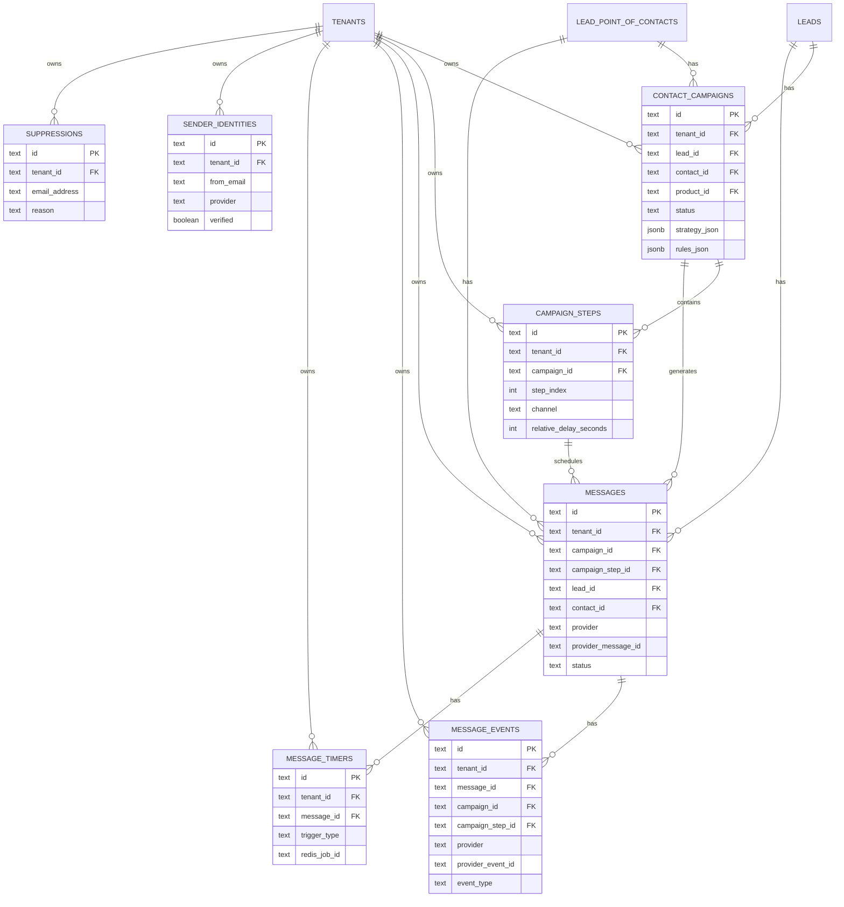

### AI-Personalized Campaign System Architecture (Email-first, Multi-channel Ready)

#### Executive summary
- **Goal**: Per-contact, AI-personalized outreach campaigns that react to engagement (open/click/reply/etc.), starting with email via SendGrid, designed to extend to other channels.
- **Core**: SQL is the source of truth for plans, steps, messages, events. BullMQ (Redis) provides scalable, delayed job orchestration for sending and timeouts. SendGrid webhooks feed engagement events.
- **Scale**: Millions of leads, ~5 contacts/lead, ~10 touchpoints/contact (50M+ touchpoints), hundreds of millions of events. Use “schedule-next” and a rolling horizon to limit queued jobs.

---

### Data model (Postgres, Drizzle-style)
All tables include: `id text primary key`, `tenant_id text not null`, `created_at timestamp default now()`, `updated_at timestamp default now()`. Use `text` for enums, `jsonb` for extensibility, align with existing `dripiq_app` schema and naming (`lead_point_of_contacts`, `lead_products`, etc.).

- **contact_campaigns**
  - Keys: `id`, `tenant_id`, `lead_id`, `contact_id`, `product_id` (nullable), `created_by_user_id` (nullable)
  - Fields: `status` (draft|active|paused|completed|canceled), `started_at`, `completed_at`
  - Fields: `strategy_json jsonb` (AI output snapshot), `rules_json jsonb` (adaptive rules), `settings_json jsonb` (send windows, timezone)
  - Indexes: `(tenant_id, status)`, `(tenant_id, contact_id)`, `(tenant_id, started_at)`
  - Constraint: unique active campaign per contact/product (partial index where status in ('active','paused'))

- **campaign_steps**
  - Keys: `id`, `tenant_id`, `campaign_id`
  - Fields: `step_index int` (0-based), `channel` (email|call|sms|linkedin|custom), `relative_delay_seconds int`
  - Fields: `subject_template text` (nullable), `body_template text`, `call_to_action text` (nullable), `send_window jsonb` (optional), `metadata jsonb`
  - Fields: `status` (pending|scheduled|sent|skipped|canceled), `scheduled_at`, `sent_at`
  - Indexes: `(campaign_id, status)`, `(campaign_id, step_index)` unique, `(tenant_id, scheduled_at)`

- **messages**
  - Keys: `id`, `tenant_id`, `campaign_id` (nullable), `campaign_step_id` (nullable), `lead_id`, `contact_id`
  - Fields: `channel` (email|call|sms|linkedin), `direction` (outbound|inbound)
  - Provider: `provider` (sendgrid|twilio|aircall|...), `provider_message_id text` (nullable, unique per provider)
  - Email: `from_address text`, `from_name text`, `to_address text`, `subject text`, `body_text text`, `body_html text`, `attachments jsonb`
  - Status: `status` (queued|processing|sent|failed), `attempt_count int`, `last_error text`, `scheduled_at`, `sent_at`
  - Idempotency: `idempotency_key text` (unique, nullable)
  - BullMQ: `redis_job_id text` (nullable), `queue_name text` (nullable)
  - Indexes: `(tenant_id, status, scheduled_at)`, `(provider, provider_message_id)`, `(tenant_id, contact_id)`

- **message_events**
  - Keys: `id`, `tenant_id`, `message_id`
  - Denorm: `campaign_id` (nullable), `campaign_step_id` (nullable)
  - Provider: `provider text`, `provider_event_id text` (nullable, unique), `event_type text`
  - Fields: `occurred_at timestamp`, `received_at timestamp default now()`, `url_clicked text` (nullable), `user_agent text` (nullable), `ip text` (nullable), `geo jsonb` (nullable), `raw_event jsonb`
  - Indexes: `(message_id, event_type)`, `(tenant_id, occurred_at desc)`, `(provider, provider_event_id)`

- **message_timers** (for synthetic timeouts managed via BullMQ)
  - Keys: `id`, `tenant_id`, `message_id`, `trigger_type text` (e.g., no_open_48h, no_reply_72h)
  - Fields: `redis_job_id text`, `scheduled_for timestamp`, `status` (active|fired|canceled)
  - Indexes: `(tenant_id, status, scheduled_for)`, `(message_id, trigger_type)` unique

- **sender_identities**
  - Keys: `id`, `tenant_id`
  - Fields: `from_email text`, `from_name text`, `provider text` (sendgrid)
  - Fields: `provider_config_id text` (reference to secrets manager), `verified boolean`, `domain text`, `reply_to text` (nullable)
  - Unique: `(tenant_id, from_email)`

- **suppressions**
  - Keys: `id`, `tenant_id`
  - Fields: `contact_id text` (nullable), `email_address text`, `reason text` (unsubscribe|bounce|complaint|manual), `source text` (provider|user|system), `occurred_at timestamp`
  - Unique: `(tenant_id, email_address, reason)`
  - Index: `(tenant_id, email_address)`

- **rate_limits** (optional, can be externalized to Redis)
  - Keys: `id`, `tenant_id`, `channel`
  - Fields: `per_minute int`, `per_hour int`, `per_day int`, `window_started_at timestamp`, `sent_in_window int`
  - Index: `(tenant_id, channel)`

Optional (for auditing): **ai_generations** with inputs/outputs, tokens, duration, correlation_id.

---

### BullMQ queues and job model
- **Queues**
  - `email:send` — delayed jobs for outbound email sends
  - `event:process` — process provider/webhook events and apply rules
  - `timeout:process` — fire synthetic timeouts (no_open_Xh, no_reply_Xh)
  - Optional: `campaign:expand` — offload expansion of AI strategies into steps/messages

- **Job IDs (deterministic)**
  - `email:send`: `jobId = message_id`
  - `timeout:process`: `jobId = ${message_id}:${trigger_type}`
  - `event:process`: `jobId = provider_event_id` (fallback to a composite key if absent)

- **Rate limiting**
  - Per-queue limiter plus Redis token bucket per tenant/channel.
  - Option A: one shared `email:send` queue, check per-tenant budget inside worker and reschedule if over.
  - Option B: one queue per tenant `email:send:{tenant_id}` with its own limiter (clear isolation, more queues).

---

### Step-by-step flow
1) **Campaign creation and scheduling**
- Ingest lead and contacts; call AI to generate per-contact strategy.
- Persist `contact_campaigns.strategy_json` and `rules_json`; set `status=active`.
- Expand into `campaign_steps` with `relative_delay_seconds` and initial `scheduled_at` respecting send windows and suppressions.
- Create the first `messages` for steps due now or within a short horizon; enqueue BullMQ `email:send` delayed jobs with `jobId=message_id`. Store `messages.redis_job_id` and `messages.queue_name`.

2) **Dispatch**
- Workers consume `email:send` jobs with concurrency.
- For each job: re-check `suppressions` and `sender_identities`, enforce rate limits, render subject/body, send via SendGrid.
- Update `messages` with `status=sent`, `sent_at`, `provider_message_id`.
- If the plan requires a timeout (e.g., no_open_48h), enqueue `timeout:process` with `jobId=${message_id}:no_open_48h` and insert `message_timers` as `active`.

3) **Webhooks and event processing**
- SendGrid webhooks call the API; handler inserts `message_events` (dedupe on `provider_event_id`) and enqueues `event:process` by that id.
- Event processor loads the event → message → step → campaign and reads `rules_json`.
  - open/click: mark relevant step status, schedule next step by creating next-step `messages` and enqueue `email:send` with computed delay; cancel any active timers for this message.
  - reply (Inbound Parse): insert inbound `messages` (`direction=inbound`), add `message_event=reply`, cancel the campaign and skip remaining steps, cancel timers.
  - unsubscribe/bounce: upsert `suppressions`, cancel campaign and skip steps, cancel timers.
  - deferred/temporary failure: backoff; after max attempts, mark `messages` failed.

4) **Timeouts**
- BullMQ fires `timeout:process` jobs at the scheduled time.
- Worker verifies the condition (e.g., no open/click recorded). If still true, apply rule (e.g., schedule bump); mark `message_timers.status=fired`. If not applicable, mark canceled.

---

### AI strategy JSON (contract)
- Aligns with current zod types. Store in `contact_campaigns.strategy_json`; runtime rules in `rules_json`.

```json
{
  "summary": "VP Eng outreach tailored to reliability",
  "cadence": { "interval": "2-4 days", "totalDuration": "14 days" },
  "outreachCampaign": [
    { "type": "email", "timing": "Day 0", "subject": "Cut downtime by 30%", "content": "Hi Jane...", "callToAction": "15-min chat" },
    { "type": "email", "timing": "Day 3", "subject": "Quick benchmark", "content": "We helped...", "callToAction": "Worth a look?" },
    { "type": "email", "timing": "Day 7", "subject": "Case study", "content": "Saw you use...", "callToAction": "Share a snippet?" }
  ],
  "adaptiveRules": [
    { "trigger": "open", "action": { "type": "schedule_next_step", "payload": { "delaySeconds": 86400 } } },
    { "trigger": "click", "action": { "type": "skip_to_step", "payload": { "stepIndex": 2 } } },
    { "trigger": "reply", "action": { "type": "cancel_campaign" } },
    { "trigger": "unsubscribe", "action": { "type": "cancel_campaign" } },
    { "trigger": "no_open_48h", "action": { "type": "reschedule_step", "payload": { "delaySeconds": 86400 } } }
  ]
}
```

---

### Sequence diagram


---

### SendGrid mapping
- Event to `message_events.event_type`: processed, delivered, open, click, bounce, deferred, spamreport, unsubscribe, dropped, reply (inbound parse).
- Use `custom_args` to include `campaign_id`, `step_index`, `message_id`. Always store `provider_message_id` and join webhooks by it.

---

### Scalability tactics
- **Schedule-next**: Do not enqueue all touchpoints upfront; enqueue only the next step per contact. Use a rolling horizon (e.g., 24–48h) to batch future steps.
- **Redis**: Use Redis Cluster; shard queues by `tenant_id` or consistent hashing; enable `removeOnComplete`/`removeOnFail` and keep payloads small (fetch from DB on consume).
- **Workers**: Horizontal scale; concurrency tuned per shard/tenant. Idempotent jobIds avoid duplicates.
- **Postgres**: Partition `message_events` (time-based, optional tenant subpartitions). Index: `(provider, provider_message_id)`, `(tenant_id, occurred_at desc)`. Use read replicas for analytics.
- **Throughput**: Autoscale based on queue depth and webhook lag. Apply backpressure to campaign creation if dispatch lags.

---

### Idempotency, retries, and safety
- Idempotent job IDs: `message_id`, `${message_id}:${trigger_type}`, `provider_event_id`.
- On send failure: exponential backoff; max attempts; mark `messages.status=failed`.
- Webhooks: dedupe by `provider_event_id` (or composite fallback).
- Cancelability: store `redis_job_id`; remove delayed jobs on open/click; set `message_timers.status=canceled`.
- Guardrails: verify `suppressions` and `sender_identities` at enqueue + send time. Enforce `rate_limits`.

---

### Privacy and compliance
- Maintain `suppressions` on unsubscribe/bounce/complaint; check pre-send.
- Include unsubscribe tokens per message; webhook sets suppression and cancels campaign.
- Retention: keep `messages` long-term; keep `message_events` partitions ~90–180 days; compress or drop `raw_event` early.

---

### Migration plan (phased)
1) `sender_identities`, `suppressions` tables
2) `contact_campaigns`, `campaign_steps`
3) `messages` (with `redis_job_id`, `queue_name`) and `message_timers`
4) `message_events` and webhook route
5) BullMQ workers: `email:send`, `event:process`, `timeout:process`
6) Rate limiting (Redis token bucket) and horizon hydrator if desired

---

### Open questions
- Campaign scoping: per `(contact, product)` or per `(contact, lead)`? Recommend including `product_id` when messaging is product-specific.
- Per-tenant queue isolation vs. shared queue with internal limiter? Start with shared, move to per-tenant for heavy tenants.
- Default rules if AI omits `adaptiveRules`? Provide sensible system defaults.

---

### Why this design
- **Separation of concerns**: Plans/steps/messages/events in SQL; orchestration in BullMQ.
- **Reactive and extensible**: Event-driven transitions; channels generalized via `channel` fields and provider adapters.
- **Scalable**: Schedule-next and horizon reduce queued jobs; partitioned events and sharded queues handle high volume.
- **Auditable**: Every decision traceable to rows with IDs carried through provider `custom_args`.

---

### Appendix: index checklist
- `messages(provider, provider_message_id)`
- `message_events(tenant_id, occurred_at desc)`
- `campaign_steps(campaign_id, step_index)` unique
- `contact_campaigns(tenant_id, status)`
- `suppressions(tenant_id, email_address)`
- Partial unique on active campaigns per contact/product

---

### Appendix: defaults
- On open: schedule next step in 1–2 days
- On click: skip to next or step N per rule
- On reply/unsubscribe/bounce: cancel campaign and skip remaining steps
- No-open 48h: reschedule bump with +24h unless business hours block

---

### Proposed SQL schema (DDL sketch)
Note: Illustrative Postgres-leaning DDL; align with Drizzle migrations and your `dripiq_app` schema.

```sql
-- contact_campaigns
create table dripiq_app.contact_campaigns (
  id text primary key,
  tenant_id text not null references dripiq_app.tenants(id) on delete cascade,
  lead_id text not null references dripiq_app.leads(id) on delete cascade,
  contact_id text not null references dripiq_app.lead_point_of_contacts(id) on delete cascade,
  product_id text references dripiq_app.products(id) on delete cascade,
  created_by_user_id text references dripiq_app.users(id) on delete set null,
  status text not null default 'active',
  started_at timestamp,
  completed_at timestamp,
  strategy_json jsonb not null,
  rules_json jsonb,
  settings_json jsonb,
  created_at timestamp not null default now(),
  updated_at timestamp not null default now()
);
create index on dripiq_app.contact_campaigns (tenant_id, status);
create index on dripiq_app.contact_campaigns (tenant_id, contact_id);

-- ensure only one active or paused per (tenant, contact, product)
create unique index contact_campaign_active_unique on dripiq_app.contact_campaigns
  (tenant_id, contact_id, coalesce(product_id, ''))
  where status in ('active','paused');

-- campaign_steps
create table dripiq_app.campaign_steps (
  id text primary key,
  tenant_id text not null references dripiq_app.tenants(id) on delete cascade,
  campaign_id text not null references dripiq_app.contact_campaigns(id) on delete cascade,
  step_index int not null,
  channel text not null,
  relative_delay_seconds int not null,
  subject_template text,
  body_template text not null,
  call_to_action text,
  send_window jsonb,
  metadata jsonb,
  status text not null default 'pending',
  scheduled_at timestamp,
  sent_at timestamp,
  created_at timestamp not null default now(),
  updated_at timestamp not null default now(),
  unique (campaign_id, step_index)
);
create index on dripiq_app.campaign_steps (campaign_id, status);
create index on dripiq_app.campaign_steps (tenant_id, scheduled_at);

-- messages
create table dripiq_app.messages (
  id text primary key,
  tenant_id text not null references dripiq_app.tenants(id) on delete cascade,
  campaign_id text references dripiq_app.contact_campaigns(id) on delete set null,
  campaign_step_id text references dripiq_app.campaign_steps(id) on delete set null,
  lead_id text not null references dripiq_app.leads(id) on delete cascade,
  contact_id text not null references dripiq_app.lead_point_of_contacts(id) on delete cascade,
  channel text not null,
  direction text not null,
  provider text not null,
  provider_message_id text,
  from_address text,
  from_name text,
  to_address text,
  subject text,
  body_text text,
  body_html text,
  attachments jsonb,
  status text not null default 'queued',
  attempt_count int not null default 0,
  last_error text,
  scheduled_at timestamp,
  sent_at timestamp,
  idempotency_key text,
  redis_job_id text,
  queue_name text,
  metadata jsonb,
  created_at timestamp not null default now(),
  updated_at timestamp not null default now()
);
create unique index on dripiq_app.messages (provider, provider_message_id) where provider_message_id is not null;
create index on dripiq_app.messages (tenant_id, status, scheduled_at);
create index on dripiq_app.messages (tenant_id, contact_id);

-- message_events
create table dripiq_app.message_events (
  id text primary key,
  tenant_id text not null references dripiq_app.tenants(id) on delete cascade,
  message_id text not null references dripiq_app.messages(id) on delete cascade,
  campaign_id text references dripiq_app.contact_campaigns(id) on delete set null,
  campaign_step_id text references dripiq_app.campaign_steps(id) on delete set null,
  provider text not null,
  provider_event_id text,
  event_type text not null,
  occurred_at timestamp not null,
  received_at timestamp not null default now(),
  url_clicked text,
  user_agent text,
  ip text,
  geo jsonb,
  raw_event jsonb,
  created_at timestamp not null default now()
);
create unique index on dripiq_app.message_events (provider, provider_event_id) where provider_event_id is not null;
create index on dripiq_app.message_events (message_id, event_type);
create index on dripiq_app.message_events (tenant_id, occurred_at desc);

-- message_timers
create table dripiq_app.message_timers (
  id text primary key,
  tenant_id text not null references dripiq_app.tenants(id) on delete cascade,
  message_id text not null references dripiq_app.messages(id) on delete cascade,
  trigger_type text not null,
  redis_job_id text,
  scheduled_for timestamp not null,
  status text not null default 'active',
  created_at timestamp not null default now(),
  updated_at timestamp not null default now(),
  unique (message_id, trigger_type)
);
create index on dripiq_app.message_timers (tenant_id, status, scheduled_for);

-- sender_identities
create table dripiq_app.sender_identities (
  id text primary key,
  tenant_id text not null references dripiq_app.tenants(id) on delete cascade,
  from_email text not null,
  from_name text,
  provider text not null,
  provider_config_id text not null,
  verified boolean not null default false,
  domain text,
  reply_to text,
  created_at timestamp not null default now(),
  updated_at timestamp not null default now(),
  unique (tenant_id, from_email)
);

-- suppressions
create table dripiq_app.suppressions (
  id text primary key,
  tenant_id text not null references dripiq_app.tenants(id) on delete cascade,
  contact_id text references dripiq_app.lead_point_of_contacts(id) on delete set null,
  email_address text not null,
  reason text not null,
  source text not null,
  occurred_at timestamp not null,
  created_at timestamp not null default now(),
  updated_at timestamp not null default now(),
  unique (tenant_id, email_address, reason)
);
create index on dripiq_app.suppressions (tenant_id, email_address);
```

---

### ER diagram


---

### Table-by-table rationale
- **contact_campaigns**: Per-contact (optionally per-product) campaign plan and status. Stores the AI’s `strategy_json` and `rules_json` so the engine can reproduce decisions and audits. Needed to separate the durable plan from execution details, enable pause/resume/cancel, and compute analytics per campaign.
- **campaign_steps**: Ordered steps derived from the plan. Keeps timing, channel, and templates for each step. Needed so the engine can schedule-next or reschedule specific steps, track outcomes per step, and provide a clear UI timeline.
- **messages**: Concrete send (or inbound reply) instances tied to steps. Stores final rendered content, provider IDs, and send status. Needed for auditing, idempotency, webhooks correlation, and step-level analytics. Even with Redis PITR, SQL is required as the system-of-record for compliance and joins.
- **message_events**: Normalized provider events (open/click/bounce/etc.). Drives reactive logic and supports analytics. Needed to adapt campaigns in real time and to measure performance accurately. Partition this for scale.
- **message_timers**: Durable map of synthetic timeouts (e.g., no-open-after-48h) with a pointer to the BullMQ job. Needed to cancel timers when engagement occurs and to recover after worker restarts, keeping visibility into pending vs. fired timers.
- **sender_identities**: Verified sender configuration per tenant. Needed to enforce compliance, select from-addresses, and avoid provider rejections.
- **suppressions**: Do-not-contact list (unsubscribe, bounces, complaints, manual blocks). Needed to proactively prevent sends and to cancel active campaigns immediately upon suppression events.
- **rate_limits**: Optional persistent budget definitions if not fully in Redis. Needed when you want DB-backed limits and reporting; otherwise use Redis token buckets.