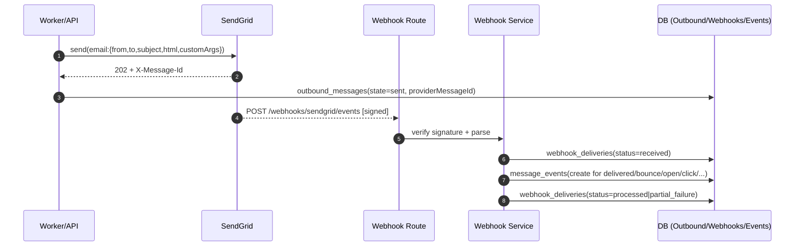

### Email Flow Audit

#### System Overview
- **Provider**: SendGrid via `@sendgrid/mail` and `@sendgrid/client`.
- **Sending Path**: `server/src/workers/campaign-execution/email-execution.service.ts` uses `sendgridClient.sendEmail(...)`.
- **Unsubscribe**: HTML emails append an unsubscribe link via `sendgridClient.appendUnsubscribeLink(...)` to `GET /api/unsubscribe`.
- **Custom Args/Corr Ids**: `tenant_id`, `campaign_id`, `node_id`, `outbound_message_id`, `dedupe_key` are set through SendGrid `customArgs` and returned in webhooks.
- **Webhook**: `POST /api/webhooks/sendgrid/events` with signature verification using `SENDGRID_WEBHOOK_PUBLIC_KEY` and timestamp max age.
- **Storage**:
  - Raw: `webhook_deliveries` via `webhookDeliveryRepository`.
  - Events: `message_events` via `messageEventRepository`.
  - Outbound messages: `outbound_messages` via `outboundMessageRepository`.

#### Sequence Flow (Send → Webhooks)


#### State Transitions/Campaign Integration
- Message events created with `messageId = outbound_message_id` enable campaign transitions via `campaignPlanExecutionService.processTransition(...)` for successful events.
- Timeouts scheduled post-send (no_open/no_click) in `EmailExecutionService` using BullMQ.

#### Webhook Validation
- Route: `server/src/routes/sendgrid.webhook.routes.ts`.
- Security: required headers, raw-body parser, ECDSA verification via `SendGridWebhookValidator`, optional IP allow list, JSON content-type, body size limit, rate limit.
- Processing: `SendGridWebhookService.processWebhook(...)` performs parse, tenant extraction, raw storage, per-event processing, duplicate detection on `sg_event_id`, normalization, batch campaign transitions.

#### Diagram: Event Normalization
```mermaid
flowchart TD
  A[SendGrid Event] -->|validate type| B{Known + recordable?}
  B -- no --> C[skip]
  B -- yes --> D[create message_events]
  D --> E[normalized types: delivered|bounce|dropped|open|click|spam|unsubscribe|resubscribe]
  D --> F[duplicate check by sg_event_id]
  F -->|dup| C
  F -->|new| G[emit event + campaign transition]
```

#### Glaring Risks/Flaws Before Prod
- Unsubscribe handling in webhooks marked TODO; suppression relies on the pre-send `unsubscribeService.isChannelUnsubscribed(...)` but does not currently auto-suppress on `unsubscribe`/`group_unsubscribe`/`spam_report` events.
- IP allow list is optional; recommend enable with SendGrid IP ranges for prod.
- `API_URL` required for unsubscribe link; missing env throws on send. Ensure set across envs.
- `providerMessageId` is stored at send time, but webhook processing correlates primarily via `outbound_message_id` custom arg; ensure templates always include `customArgs` (currently done in `sendgridClient.buildCustomArgs`).
- Duplicate detection uses `sg_event_id` only; if SendGrid retries without same `sg_event_id`, duplicates could slip. Consider secondary idempotency on hash(email+type+timestamp+sg_message_id).
- Delivery/non-delivery side effects (e.g., bounce → suppression) are not implemented; risk of continued sends to bad addresses.
- No explicit handling of `deferred` (skipped as expected) or backfill of outbound message state based on delivered/bounce; downstream relies on `message_events` not updating `outbound_messages.state`.
- Logs may include raw payload in validator warn; ensure sensitive data policies are acceptable.

#### Environment/Config Checklist
- SENDGRID_API_KEY
- SENDGRID_WEBHOOK_PUBLIC_KEY (base64, length >= 50)
- SENDGRID_WEBHOOK_ENABLED=true
- SENDGRID_WEBHOOK_MAX_AGE (e.g., 600)
- SENDGRID_WEBHOOK_DUPLICATE_DETECTION=true
- SENDGRID_WEBHOOK_BATCH_PROCESSING=true
- SENDGRID_WEBHOOK_ALLOWED_IPS (prod)
- API_URL (used for unsubscribe link)

#### Validation Plan (Staging/Local)
- Configure webhook to tunnel to `/api/webhooks/sendgrid/events` and set `SENDGRID_WEBHOOK_PUBLIC_KEY`.
- Trigger a real send via the campaign flow; confirm `outbound_messages` has `providerMessageId` and sent state.
- Use SendGrid “Test Your Integration” to deliver events; verify:
  - `webhook_deliveries` created with status processed/partial_failure.
  - `message_events` created for delivered/open/click/bounce.
  - Duplicate replay is skipped by `sg_event_id`.
  - Campaign transition processor runs for delivered/open/click.
- Negative tests: missing/invalid signature → 401; content-type mismatch → 400; disabled processing → 503.

#### Recommended Remediations
- Implement suppression writes on `unsubscribe`, `group_unsubscribe`, `spam_report`, and hard `bounce` to `communication_suppression` and/or `contact_unsubscribe`.
- Consider updating `outbound_messages.state` on terminal outcomes (delivered, bounced, dropped) for easier querying.
- Add secondary idempotency guard keyed by hash of salient fields.
- Enable IP allow list in prod; document SendGrid IP ranges.
- Ensure redaction of PII in logs; keep payloads but avoid full raw bodies in warn-level logs.
- Add CI e2e test to simulate webhook events against service (mock signature) and assert DB updates.

#### References
- `server/src/workers/campaign-execution/email-execution.service.ts`
- `server/src/libs/email/sendgrid.client.ts`
- `server/src/routes/sendgrid.webhook.routes.ts`
- `server/src/modules/webhooks/sendgrid.webhook.service.ts`
- `server/src/modules/webhooks/sendgrid.webhook.types.ts`
- `server/docs/SENDGRID_WEBHOOK.md`