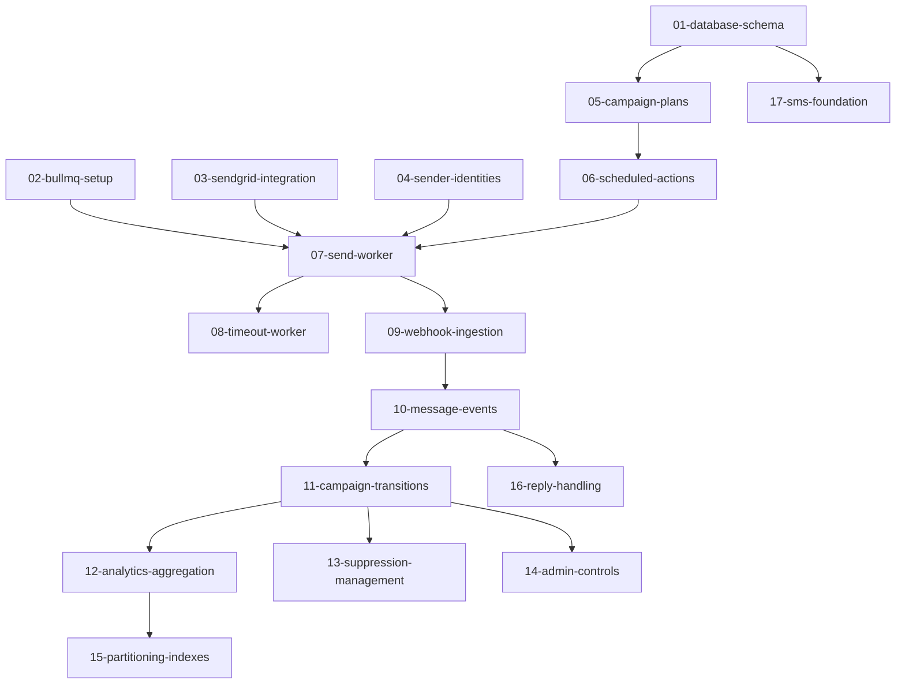

# Implementation Overview

This document provides a high-level roadmap for implementing the outreach campaign architecture. Each phase builds upon the previous one, allowing for incremental delivery and testing.

## Implementation Phases

### Phase 1: Foundation (Tickets 01-04)
Core database schema and basic infrastructure setup.

- **01-database-schema**: Create all new tables and relationships
- **02-bullmq-setup**: Configure Redis and BullMQ infrastructure  
- **03-sendgrid-integration**: Basic SendGrid client and email validation
- **04-sender-identities**: AE sender identity management

**Dependencies**: None
**Deliverable**: Database schema created, BullMQ operational, basic SendGrid integration

### Phase 2: Core Campaign Engine (Tickets 05-08)
The heart of the campaign system - plan storage and execution.

- **05-campaign-plans**: Campaign plan JSON storage and versioning
- **06-scheduled-actions**: SQL-based scheduling system
- **07-send-worker**: Core email sending worker with rate limiting
- **08-timeout-worker**: Synthetic event generation for no-open/no-click

**Dependencies**: Phase 1 complete
**Deliverable**: Can create and execute basic email campaigns

### Phase 3: Event Processing (Tickets 09-11)
Webhook ingestion and reactive campaign logic.

- **09-webhook-ingestion**: SendGrid webhook processing
- **10-message-events**: Event normalization and storage
- **11-campaign-transitions**: State machine execution and transitions

**Dependencies**: Phase 2 complete
**Deliverable**: Campaigns react to engagement events

### Phase 4: Analytics & Monitoring (Tickets 12-14)
Observability, metrics, and dashboard support.

- **12-analytics-aggregation**: Materialized views and rollup tables
- **13-suppression-management**: Unsubscribe and bounce handling
- **14-admin-controls**: Tenant controls and campaign management

**Dependencies**: Phase 3 complete
**Deliverable**: Full analytics dashboard, compliance controls

### Phase 5: Scaling & Extensions (Tickets 15-17)
Performance optimizations and SMS preparation.

- **15-partitioning-indexes**: Database optimization for scale
- **16-reply-handling**: Inbound message processing
- **17-sms-foundation**: Prepare schema and workers for SMS

**Dependencies**: Phase 4 complete
**Deliverable**: Production-ready at scale, SMS-ready architecture

## Critical Path

The critical path for MVP (minimum viable product) includes tickets 01-11. Tickets 12-17 can be implemented in parallel or after initial launch.

## Implementation Guidelines

### Code Organization
- New database migrations in `server/src/db/migrations/`
- Campaign services in `server/src/modules/campaigns/`
- BullMQ workers in `server/src/workers/`
- SendGrid integration in `server/src/libs/sendgrid/`

### Testing Strategy
- Unit tests are not required at this time
- End-to-end verification and manual checks during rollout
- Load testing to be added post-MVP

### Rollout Strategy
- Feature flags for gradual tenant rollout
- Shadow mode for webhook processing initially
- Gradual rate limit increases during IP warming
- Monitoring and alerting at each phase

## Dependencies Between Tickets

## Resource Requirements

### Development
- 1-2 backend engineers for 8-12 weeks
- 1 DevOps engineer for infrastructure setup
- 1 QA engineer for testing framework

### Infrastructure
- Redis instance for BullMQ
- SendGrid account with dedicated IPs
- Database migration downtime (minimal with proper planning)

## Risk Mitigation

### High-Risk Areas
- **Email deliverability**: Start with conservative sending limits
- **Webhook reliability**: Implement idempotency and retry logic
- **Database performance**: Monitor query performance, add indexes proactively
- **Rate limiting**: Use Redis-based token buckets, monitor send rates

### Rollback Plan
- Each phase has independent feature flags
- Database migrations are backwards compatible where possible
- BullMQ jobs are idempotent and can be safely retried
- Campaign execution can be paused per-tenant

## Success Metrics

### Phase 1-2 Success
- All database tables created successfully
- Basic campaign creation and execution working
- SendGrid integration sending emails

### Phase 3 Success  
- Webhooks processing without data loss
- Campaigns advancing based on engagement
- No duplicate sends or missed events

### Phase 4-5 Success
- Analytics dashboard showing real-time metrics
- Suppression lists preventing unwanted sends
- System handling target scale (1M+ leads, 50M+ touchpoints)
