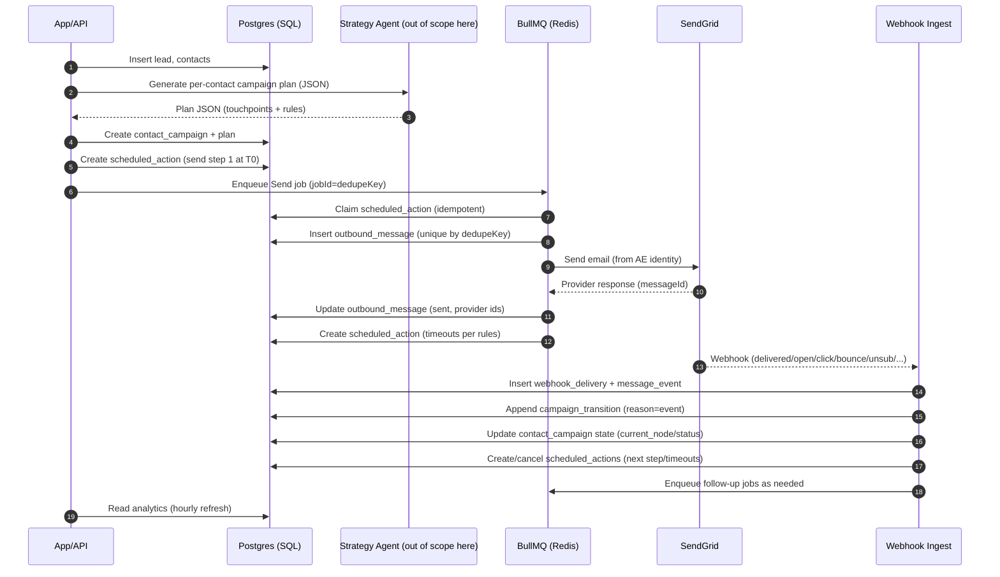
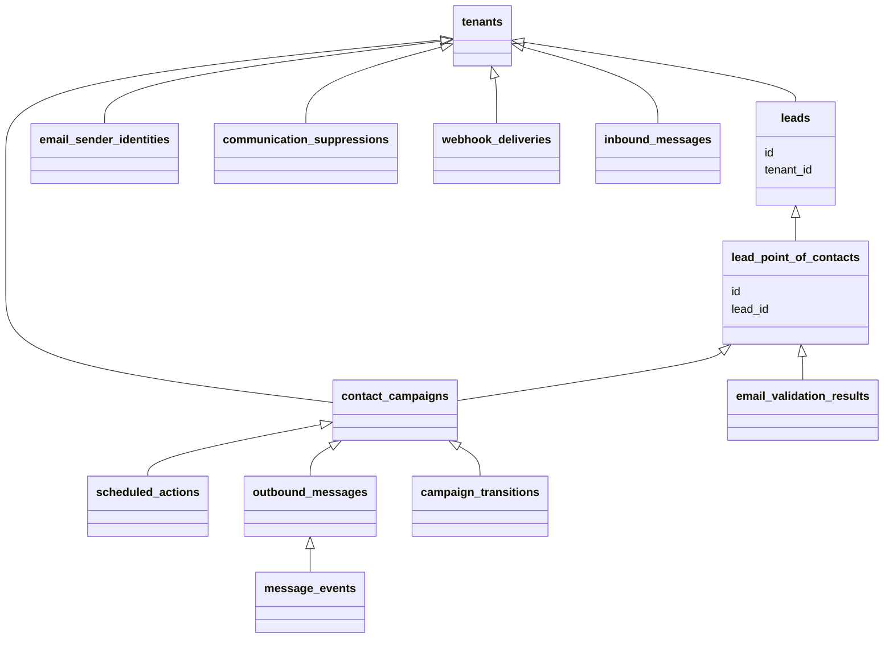

## Executive summary

- **Goal**: Per-contact, AI-personalized outreach campaigns that react to engagement (open/click/reply/etc.), starting with email via SendGrid, extendable to SMS next and other channels later.
- **Source of truth**: PostgreSQL (Supabase) stores campaign plans, state, messages, and events. JSON-based reactive logic defines flows.
- **Orchestration**: BullMQ (Redis) handles scalable scheduling, delivery, and timeouts with strict idempotency.
- **Ingestion**: SendGrid webhooks feed all engagement events; inbound parse captures replies for analysis (no reply-driven automations yet).
- **Scale targets**: ~10 tenants × 100k leads = 1M leads; ~5–20 contacts/lead; ~10 touchpoints/contact; 50M+ touchpoints; hundreds of millions of events.
- **Tenancy**: Per-tenant suppression, per-tenant rate limits; sender identity is per-AE.

## High-level flow

1) Lead and contacts ingested; per-contact plan generated by AI upfront and stored as JSON.
2) For each contact/channel, we create a campaign instance with initial node and schedule the first send via BullMQ.
3) Send worker renders content, enforces idempotency and rate limits, sends via SendGrid, records the message.
4) Webhooks ingest engagement, normalize to SQL events, advance campaign state, and schedule next actions/timeouts.
5) Analytics aggregate per-message/contact/campaign/tenant; dashboards refresh hourly.

## Sequence diagram (lead → contact campaign)



## Reactive logic JSON (DSL) — stable, AI-friendly

- Stored at `contact_campaigns.plan_json` and optionally versioned in `campaign_plan_versions`.
- Minimal, composable, channel-agnostic schema; email-only initially; SMS next.

Example (abbrev):

```json
{
  "version": "1.0",
  "timezone": "America/Los_Angeles",
  "quietHours": { "start": "21:00", "end": "07:30" },
  "nodes": [
    {
      "id": "email_intro",
      "channel": "email",
      "action": "send",
      "subject": "{subject}",
      "body": "{personalized_body}",
      "senderIdentityId": "sender_123",
      "schedule": { "delay": "PT0S" },
      "transitions": [
        { "on": "opened", "to": "wait_click", "within": "PT72H" },
        { "on": "no_open", "to": "email_bump_1", "after": "PT72H" },
        { "on": "bounced", "to": "stop" },
        { "on": "unsubscribed", "to": "stop" }
      ]
    },
    {
      "id": "wait_click",
      "channel": "email",
      "action": "wait",
      "transitions": [
        { "on": "clicked", "to": "stop", "within": "PT24H" },
        { "on": "no_click", "to": "email_bump_1", "after": "PT24H" }
      ]
    },
    { "id": "email_bump_1", "channel": "email", "action": "send", "subject": "...", "body": "..." }
  ],
  "startNodeId": "email_intro"
}
```

- Supported events now: `delivered`, `opened`, `clicked`, `bounced`, `blocked`, `spamreport`, `unsubscribed`, synthetic timers: `no_open`, `no_click`.
- Defaults: `no_open` after 72h, `no_click` after 24h (overridable in plan).

## SQL schema (new tables)

Below, all tables include `id text primary key`, `tenant_id text not null`, `created_at timestamptz default now()`, `updated_at` unless stated. All FKs `on delete cascade` unless noted. Add composite indexes for high-cardinality lookups.

1) `email_sender_identities`
- Links AE user mailbox to SendGrid validation state.
- Columns: `user_id`, `from_email`, `from_name`, `domain`, `sendgrid_sender_id`, `validation_status` (pending|verified|failed), `last_validated_at`, `dedicated_ip_pool` (optional), `is_default boolean`.
- Unique: `(tenant_id, from_email)`.
- Use: selection at send time; enforce that only verified identities send.

2) `contact_campaigns`
- One per contact per channel (email now; SMS later).
- Columns: `lead_id`, `contact_id`, `channel` (email|sms), `status` (draft|active|paused|completed|stopped|error), `current_node_id`, `plan_json jsonb`, `plan_version`, `plan_hash` (for idempotency), `sender_identity_id` (default for nodes missing explicit sender), `started_at`, `completed_at`.
- Index: `(tenant_id, contact_id, channel)`, `(tenant_id, status)`, GIN on `plan_json` if needed.

3) `campaign_plan_versions` (optional but recommended)
- Audit for generated plans per contact.
- Columns: `contact_campaign_id`, `version`, `plan_json`, `generated_by` (ai|manual), `notes`.
- Unique: `(contact_campaign_id, version)`.

4) `scheduled_actions`
- SQL source-of-truth for time-based actions; mirrored into BullMQ jobs.
- Columns: `contact_campaign_id`, `node_id`, `action_type` (send|timeout|wait|cancel), `run_at timestamptz`, `job_id` (BullMQ id), `status` (pending|queued|completed|canceled|error), `dedupe_key` (e.g., tenant:campaign:node:action:run_at), `reason`.
- Unique: `(tenant_id, dedupe_key)` ensures exactly-once scheduling; index `(status, run_at)`.

5) `outbound_messages`
- One row per attempted provider send across channels.
- Columns: `contact_campaign_id`, `node_id`, `channel`, `sender_identity_id`, `to_address` (email or phone), `subject`, `body`, `rendered_body`, `provider` (sendgrid), `provider_message_id`, `smtp_id`, `status` (queued|sent|delivered|deferred|failed|bounced|blocked), `error_code`, `scheduled_at`, `sent_at`, `dedupe_key`.
- Unique: `(tenant_id, dedupe_key)` where dedupeKey = `${contact_id}:${campaign_id}:${node_id}:${channel}`.
- Index: `(tenant_id, contact_campaign_id)`, `(provider, provider_message_id)`, `(tenant_id, created_at)`.

6) `message_events`
- Normalized engagement and delivery events (and full webhook payload for long-term retention).
- Columns: `outbound_message_id nullable`, `provider` (sendgrid), `event_type` (delivered|open|click|bounce|spamreport|unsubscribe|blocked|deferred|processed), `event_at`, `url`, `ip`, `user_agent`, `provider_event_id`, `payload jsonb`.
- Indexes: `(tenant_id, outbound_message_id, event_at)`, `(tenant_id, event_type, event_at)`, `(provider, provider_event_id)`.
- Consider monthly partitioning by `event_at` for scale.

7) `webhook_deliveries`
- Raw inbound webhook envelope + signature for idempotency and audit.
- Columns: `provider`, `received_at`, `signature_valid boolean`, `payload jsonb`, `payload_hash text unique`, `processed boolean default false`, `processed_at`, `error`.
- Unique: `payload_hash` prevents duplicate processing.

8) `inbound_messages`
- Stores Inbound Parse (replies) content for later analysis (not used for automation yet).
- Columns: `channel` (email), `to_address`, `from_address`, `subject`, `text`, `html`, `attachments jsonb`, `provider_message_id`, `received_at`.
- Index: `(tenant_id, from_address, received_at)`.

9) `communication_suppressions`
- Per-tenant suppression list and reasons.
- Columns: `channel` (email|sms), `value` (email or phone), `type` (unsubscribe|bounce|spamreport|blocked|invalid), `source` (webhook|manual|validation), `first_seen_at`, `last_seen_at`.
- Unique: `(tenant_id, channel, value, type)`; index `(tenant_id, channel, value)`.
- Enforced during send and plan activation.

10) `send_rate_limits`
- Configurable per-tenant and per-channel send limits.
- Columns: `channel`, `max_per_minute`, `max_per_hour`, `max_concurrent`, `per_domain_per_minute` (optional), `notes`.
- Unique: `(tenant_id, channel)`.

11) `email_validation_results`
- Stores SendGrid Email Address Validation API results per contact email.
- Columns: `contact_id`, `email`, `result_status` (valid|risky|invalid|unknown), `score numeric`, `did_you_mean`, `raw jsonb`, `validated_at`.
- Unique: `(tenant_id, email)`; used to block sends if invalid.

12) (Optional, for multi-address contacts later) `contact_channels`
- Allows multiple addresses per contact for future extensibility.
- Columns: `contact_id`, `channel` (email|sms), `value`, `is_primary`, `validation_status`, `validated_at`.
- Unique: `(tenant_id, contact_id, channel, value)`.

13) `campaign_transitions`
- Append-only log of campaign state transitions for audit and UI drill-down.
- Columns: `contact_campaign_id`, `from_node_id`, `to_node_id`, `trigger` (event type), `reason`, `event_ref` (message_event_id), `at timestamptz`.
- Index: `(tenant_id, contact_campaign_id, at)`.

Notes:
- Existing `leads` and `lead_point_of_contacts` are reused. `contact_campaigns.lead_id/contact_id` reference current tables.
- All text PKs are cuid-like, consistent with current schema.

## Relations (light ERD)



## BullMQ orchestration

Queues (all with strict jobId-based idempotency):
- `outreach:send`: Performs rendering + provider send. Rate-limited per-tenant and per-sender.
- `outreach:timeout`: Fires synthetic events (`no_open`, `no_click`) and advances state.
- `webhook:process`: Normalizes webhook deliveries, links to `outbound_messages`, writes `message_events`, triggers transitions.

Workers:
- Send worker steps:
  1) Load `scheduled_action` and `contact_campaign` atomically.
  2) Ensure no suppression for `to_address`; ensure sender identity verified.
  3) Upsert `outbound_messages` using unique `(tenant_id, dedupe_key)`; if exists, exit (idempotent).
  4) Render and send via SendGrid. Update provider ids/status.
  5) Create follow-up `scheduled_actions` for timers in plan (e.g., `no_open` at +72h).

- Timeout worker:
  - Emits synthetic events by writing to `message_events` with type `no_open/no_click` and appends `campaign_transitions`.

- Webhook worker:
  - Compute `payload_hash`; insert into `webhook_deliveries` (`on conflict do nothing`).
  - Parse each event; link to `outbound_messages` via `smtp_id`/`sg_message_id`/`to`/`timestamp`.
  - Insert `message_events`; update `outbound_messages.status` where applicable.
  - Evaluate plan transitions; write `campaign_transitions`; update `contact_campaigns.current_node_id/status`; schedule/cancel `scheduled_actions`.

Rebuild on startup:
- Sweep `scheduled_actions` where `status=pending` and `run_at <= now()` and `job_id is null`; enqueue with jobId=`dedupe_key`.
- Sweep `outbound_messages` stuck in `queued` > X minutes for reconciliation.

## Idempotency and exactly-once

- Use dedupe keys in SQL and in BullMQ `jobId`:
  - Message sends: `${tenant}:${contact}:${campaign}:${node}:${channel}`.
  - Scheduled actions: `${tenant}:${campaign}:${node}:${action}:${run_at_iso}`.
- Wrap "create message record" and "enqueue job" in an application-level two-step with retry; job handler itself must be idempotent and check SQL constraints first.
- Webhooks: `payload_hash` uniqueness + `provider_event_id` uniqueness on `message_events` to avoid double-processing.

## Rate limiting and backoff

- Enforce in the send worker using Redis tokens per scope; also store config in `send_rate_limits`.
- Recommended initial defaults (tunable, warm IPs gradually):
  - Per-sender (AE) email: 20/min, 1,000/hour
  - Per-tenant email cap: 5,000/hour
  - Global email cap: 20,000/hour
  - Per-domain soft cap (gmail.com): 200/hour per tenant
- Dedicated IP warming: start ~200 emails/day per new IP; double every 3–4 days while monitoring bounces/spam.
- Retries/backoff for temporary/deferred errors: retry after 20 minutes; max 6 attempts; mark `deferred` vs `failed` appropriately; never duplicate send due to dedupe key.

## SendGrid integration

- Sending: Single master account with dedicated IPs; per-AE sender identity validated and stored in `email_sender_identities`.
- Tracking: Unique custom args on each message (`tenant_id`, `campaign_id`, `node_id`, `outbound_message_id`) for reliable correlation.
- Webhooks: Capture all events (processed, deferred, delivered, open, click, bounce, block, spamreport, unsubscribe). Store raw in `webhook_deliveries` and normalized rows in `message_events`.
- Inbound Parse (replies): Store in `inbound_messages` for later analysis only.
- Email Validation API: On contact import and periodically; store results in `email_validation_results`; block or flag risky/invalid before send.

## Analytics and caching

- Fact tables: `outbound_messages`, `message_events`, `campaign_transitions`.
- Derived hourly aggregates (materialized views or rollup tables):
  - `mv_metrics_contact_hourly(tenant_id, contact_id, channel, hour, sends, delivered, opens, clicks, bounces, unsubscribes, replies)`
  - `mv_metrics_campaign_daily(tenant_id, campaign_id, date, ... )`
  - `mv_metrics_tenant_daily(tenant_id, date, ... )`
- Refresh policy: background job hourly; dashboards read from materialized views; on-demand refresh triggers allowed.

## Indexing and partitioning strategy

- High-volume tables (`message_events`, `outbound_messages`) should use:
  - Composite btree indexes on `(tenant_id, event_at)` / `(tenant_id, created_at)` and `(provider, provider_message_id)`.
  - Optional GIN on `payload` if ad-hoc queries are needed; prefer structured columns for common fields.
- Native Postgres partitioning by range on month for `message_events` and optionally `outbound_messages` (no pg_partman required). Create partitions ahead of time; default partition for overflow.

## SMS extensibility

- Keep `channel` enum and `to_address` generic; add provider columns (`twilio_message_sid`, etc.) alongside SendGrid columns.
- Reuse `contact_campaigns`, `scheduled_actions`, `outbound_messages`, `message_events`, `communication_suppressions` with `channel='sms'`.
- Add SMS-specific events (delivered, failed, clicked if short links tracked, unsub via STOP) and populate suppression on STOP.

## Operational safeguards

- Quiet hours and timezone application: use `plan_json.timezone/quietHours` to schedule sends; worker skips to next window.
- Per-tenant suppression enforcement at send; also sync provider suppressions daily.
- Admin kill-switch to pause all campaigns for a tenant.
- Audit trails via `campaign_transitions` and webhook archives.

## Minimal API surfaces (outline)

- POST `/campaigns/{contactId}/create` → creates `contact_campaigns` with plan JSON and schedules start
- POST `/webhooks/sendgrid` → stores `webhook_deliveries` and enqueues `webhook:process`
- POST `/inbound/email` → stores `inbound_messages`
- GET `/campaigns/{contactId}` → current state + transitions
- GET `/metrics/...` → aggregated metrics (hourly)

## Rationale summary (why each new table)

- `email_sender_identities`: required to manage per-AE verified senders and enforce verified-from policies.
- `contact_campaigns`: one record per contact/channel campaign with current state and full plan JSON; the anchor for execution and analytics.
- `campaign_plan_versions`: auditability and reproducibility of AI-generated plans.
- `scheduled_actions`: SQL-grounded schedule for timers and sends; enables recovery/rebuild if Redis is lost.
- `outbound_messages`: authoritative outbox and dedupe surface; ties content to provider ids and statuses.
- `message_events`: normalized engagements for metrics and reactive transitions.
- `webhook_deliveries`: exact webhook archive, signatures, and idempotency hash.
- `inbound_messages`: store replies for future analysis.
- `communication_suppressions`: enforce unsubscribe/bounce/spam across all future campaigns for a tenant.
- `send_rate_limits`: per-tenant/channel tunables for controlled scale and IP warming.
- `email_validation_results`: integrate SendGrid validation to protect deliverability and UX.
- `campaign_transitions`: explainability and per-contact flow inspection in the UI.

## Migration and rollout notes

- Create tables and required indexes first; add partitioning for `message_events`.
- Gate sending behind: sender identity verified + email validation status not invalid + not suppressed.
- Start with conservative rate limits; ramp up based on deliverability metrics.
- Build workers with idempotent handlers; verify uniqueness constraints early to avoid double-sends.