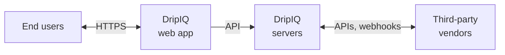
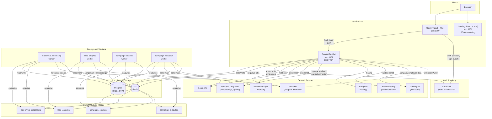
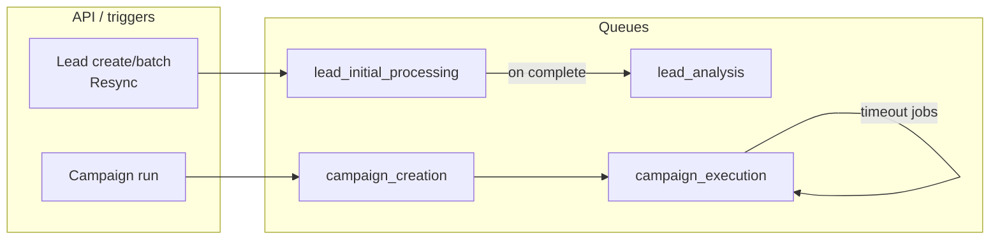

# DripIQ System Network Diagram

## Customer-facing overview (compliance / sharing)

Simplified network diagram: nodes and paths only (no product features). Suitable for sharing with prospects and customers.

| Network path | Description |
|--------------|-------------|
| **End users ↔ DripIQ web app** | User traffic over HTTPS (browser to our application). |
| **DripIQ web app → DripIQ servers** | API requests from the app to our backend. |
| **DripIQ servers ↔ Third-party vendors** | Outbound calls from our servers to vendors (e.g. auth, email, AI); vendors may call back (e.g. webhooks). |

---

## Internal architecture (technical)

High-level architecture of the monorepo: client, landing, server (API + workers), data stores, and external services.

## Queue flow (worker pipeline)

## API surface (server routes)

| Area | Routes prefix / purpose |
|------|-------------------------|
| Auth | `/api/auth/*` (register, login, me, verify-otp, logout) |
| Users & invites | `/api/users/*`, `/api/invites`, `/api/me/*` |
| Leads | `/api/leads/*` (CRUD, batch, assign-owner, contacts, analyze, products) |
| Contacts | `/api/contacts/*`, `/api/bulk-contacts` |
| Organization | `/api/organizations/*` |
| Products | `/api/products/*` |
| Dashboard | `/api/dashboard` |
| Roles | `/api/roles/*` |
| Calendar | `/api/calendar/*` |
| Logo | `/api/logo/upload` |
| Webhooks | `/api/firecrawl/*` |
| Third-party auth | `/api/third-party-auth/*` (Google, Microsoft) |
| Email validation | `/api/email-validation/*` |
| Unsubscribe | `/api/unsubscribe/*` |
| Debug / admin | `/api/debug/*`, Bull Board (queues UI) |

## Package dependency summary

| Package | Deps (conceptual) |
|---------|-------------------|
| **client** | Server API (fetch), Supabase Auth, TanStack Router/Query |
| **landing** | Standalone; TanStack Router |
| **server** | Postgres, Redis, Supabase, Firecrawl, LangChain/OpenAI, Langfuse, EmailListVerify, Gmail, Microsoft Graph, Coresignal |

---

## Third-party vendors: description and interactions

This section describes each integrated vendor and how they interact with DripIQ and with each other.

### Auth and identity

**Supabase**  
Provides authentication (sessions, sign-in/sign-out), the primary Postgres database, and object storage. The client talks to Supabase for login/logout and session handling; the server uses the Supabase Admin API for invite flows, user management, and storage (e.g. logos, site assets). All app and worker flows that need “who is this user?” or “where do we store this?” ultimately depend on Supabase.

**Google (OAuth + Gmail API)**  
Users can sign in with Google and connect Gmail for sending/receiving. The server initiates the OAuth flow and stores tokens; it then uses the Gmail API to send campaign emails and (where used) read calendar/email. Interaction is server → Google only; no webhooks from Google into DripIQ.

**Microsoft (OAuth + Microsoft Graph)**  
Same pattern as Google: sign-in with Microsoft and connect Outlook/calendar. The server uses Microsoft Graph to send mail and access calendar. Again, server → Microsoft only.

*How they interact:* Supabase is the single source of auth and identity. Google and Microsoft are optional “connect your inbox” providers; the server chooses Gmail or Microsoft Graph per tenant/campaign when sending email.

---

### Email delivery and validation

**EmailListVerify**  
Dedicated email validation API. The server calls it to verify that an address is deliverable and not risky. Used in contact/lead flows before adding contacts or sending; no callback into DripIQ.

*How they interact:* EmailListVerify is used for "is this email valid?" Email is sent via Gmail or Microsoft Graph when the user has connected their own inbox.

---

### AI and observability

**OpenAI (via LangChain)**  
Used for embeddings, agents, contact extraction from scraped content, lead and organization analysis, and related AI features. The server and workers (especially lead-initial-processing and lead-analysis) call the OpenAI API through LangChain. No webhooks from OpenAI.

**Langfuse**  
LLM observability and tracing. The server sends traces (prompts, responses, token usage) to Langfuse so you can debug and tune prompts and monitor cost/quality. All OpenAI/LangChain usage can be traced there. One-way: server → Langfuse.

*How they interact:* Every meaningful call to OpenAI is wrapped so that Langfuse receives the same request/response and metadata. No direct OpenAI ↔ Langfuse link; DripIQ is the bridge.

---

### Web scraping and web data

**Firecrawl**  
Web scraping and job orchestration. The server (or lead-initial-processing worker) requests a scrape; Firecrawl fetches and optionally processes the page, then POSTs results back to the server via webhook. That content is then used for embeddings, contact extraction, and lead analysis (which in turn use OpenAI).

**CoreSignal**  
Company and employee data (e.g. firmographics, org structure, contact info). The server calls CoreSignal when it needs enriched B2B data for leads or accounts. One-way: server → CoreSignal.

*How they interact:* Firecrawl supplies raw or processed page content; CoreSignal supplies structured company/people data. Both feed into the same lead/contact model and can be used together in analysis and campaign logic. Firecrawl is the only one that calls back into DripIQ (webhook).

---

### Observability and deployment

**Highlight**  
Error and log observability. The server sends errors and structured logs (e.g. via Pino) to Highlight. Used for debugging and monitoring; one-way, and does not drive other vendors.

**Render**  
Hosting for the app and workers. CI triggers deploys via Render’s deploy URLs. Render runs the server and workers; it does not integrate with other vendors except insofar as the code it runs calls them.

---

### End-to-end flow example

1. User signs in (Supabase) and creates a lead; client calls server API.
2. Server enqueues **lead-initial-processing**. Worker asks **Firecrawl** to scrape the lead’s site; Firecrawl later POSTs back to the server (webhook).
3. Server enqueues **lead-analysis**. Worker sends scraped content and optional **CoreSignal** data to **OpenAI** (LangChain) for embeddings and analysis; **Langfuse** records the trace.
4. Contacts may be validated with **EmailListVerify** before saving.
5. When a campaign runs, **campaign-execution** worker sends email via (**Gmail** / **Microsoft Graph** if the user connected an inbox).

Throughout, **Supabase** backs auth and persistence, **Highlight** captures errors and logs, and **Render** runs the deployed app and workers.
